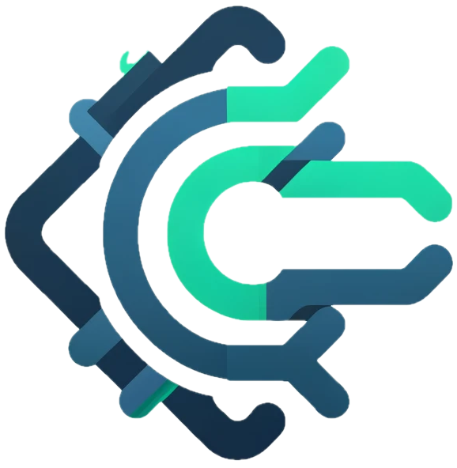

# CryptoFlow

  

`CryptoFlow` is a full-stack web application built with [Axum][0] and [SvelteKit][1]. It's a Q&A system tailored towards the world of cryptocurrency!

Its building process is explained in [this series][2] of articles.

[0]: https://github.com/tokio-rs/axum "Ergonomic and modular web framework built with Tokio, Tower, and Hyper"
[1]: https://kit.svelte.dev/ "web development, streamlined"
[2]: https://dev.to/sirneij/series/25950 "CryptoFlow: Building a secure and scalable system with Axum and SvelteKit Series"
